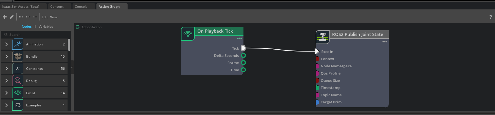

# Phase 2: Core Competencies in ROS 2 & Isaac Sim

This repository documents the hands-on development portion of Phase 2, focusing on mastering core robotics competencies. It contains foundational projects demonstrating communication with ROS 2 and control within the NVIDIA Isaac Sim environment.

For definitions of key terms used in this project, please see my central **[AI & Robotics Glossary](https://github.com/caaren/phase-0-robotics-glossary/blob/main/GLOSSARY.md)**.

---

## ✅ Skills Demonstrated

-   **ROS 2 Development:** Creating a multi-language (C++/Python) ROS 2 [Package](https://github.com/caaren/phase-0-robotics-glossary/blob/main/GLOSSARY.md#package) from scratch and building it with [Colcon](https://github.com/caaren/phase-0-robotics-glossary/blob/main/GLOSSARY.md#colcon).
-   **Robotics Communication:** Implementing the fundamental publisher/subscriber pattern for inter-node communication.
-   **Simulation & Control:** Programmatically controlling the [Isaac Sim](https://github.com/caaren/phase-0-robotics-glossary/blob/main/GLOSSARY.md#isaac-sim) simulator to spawn and command complex, articulated robots.
-   **ROS 2 Integration:** Establishing a robust communication bridge between Isaac Sim and ROS 2 for a full "sim-to-real" control and feedback loop.
-   **Visual Scripting:** Using NVIDIA's OmniGraph (Action Graph) to create a real-time data pipeline within the simulator.
-   **Systematic Debugging:** Diagnosing and solving build system, configuration, and API versioning issues.
-   **Version Control:** Maintaining a clean, professional [Git](https://github.com/caaren/phase-0-robotics-glossary/blob/main/GLOSSARY.md#git) repository for a public portfolio.

---

## 🚀 Projects

This repository contains four distinct foundational projects, completed in logical order.

### Project 2.1: Standalone ROS 2 Publisher/Subscriber (Python)

A foundational ROS 2 package (`ros2-ws/src/py_pubsub`) that implements the "talker/listener" pattern in Python. This demonstrates the core communication mechanism of ROS 2, forming the basis for all distributed robotics applications.

### Project 2.2: Standalone Isaac Sim Scripting

An advanced Python script (`scripts/franka_wave.py`) that demonstrates direct control over a simulated robot arm entirely within Isaac Sim. The script loads a Franka Emika Panda robot and makes it perform a continuous waving motion by sending a sinusoidal wave of joint position commands.

-   **[▶️ Watch the robot in action on YouTube](https://youtu.be/MKuvEEEHLwQ)**

### Project 2.3: ROS 2 & Isaac Sim Bridge (OmniGraph)

This project demonstrates the fundamental workflow for connecting Isaac Sim to the ROS 2 ecosystem. It uses the visual scripting capabilities of **OmniGraph** to create a pipeline that reads the real-time joint states of the simulated Franka robot and publishes them to the standard `/joint_states` ROS 2 topic. This is the "Hello World" for sim-to-real feedback.

-   **[▶️ Watch the live data stream on YouTube](https://www.youtube.com/watch?v=2jHL1TsLq30)**

*The OmniGraph visually represents the data flow from the simulation tick to the ROS 2 publisher.*

---

## 🛠️ How to Build and Run

Detailed instructions for each project are contained within their respective folders/documentation. A high-level overview is provided here.

1.  **Isaac Sim Scripts (Project 2.2):** Execute a script using the bundled Python interpreter: `./python.sh /path/to/scripts/franka_wave.py`.
2.  **ROS 2 Package (Project 2.1):** Build the package with `colcon build` and run the nodes with `ros2 run py_pubsub talker/listener`.
3.  **Isaac Sim & ROS 2 Bridge (Project 2.3):** Load the `.usd` scene in Isaac Sim, press Play, and use `ros2 topic echo /joint_states` to verify the data stream.

---

## ⏭️ What's Next

The final project for Phase 2 is **Project 2.4: Standalone ROS 2 Publisher/Subscriber (C++)**. This will demonstrate proficiency in the second of the two primary languages used in professional robotics.

---

## 📜 License

This project is licensed under the Apache 2.0 License. See the [`LICENSE`](./LICENSE) file for details.